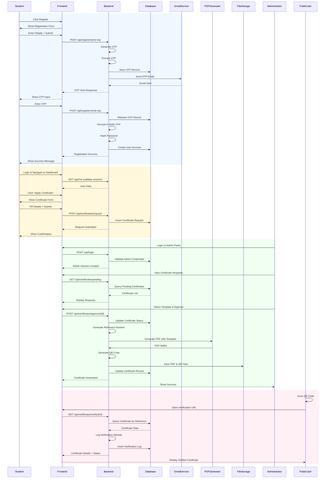
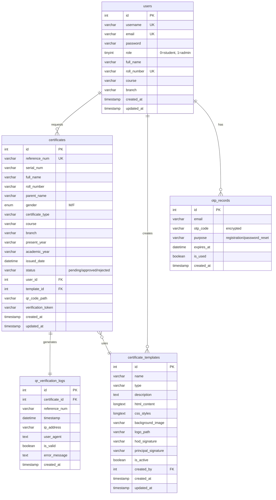
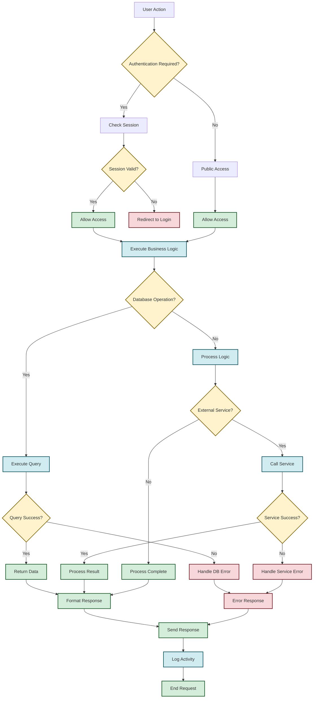
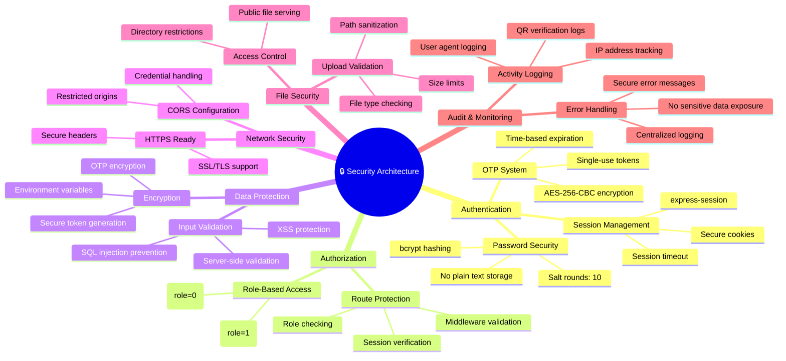
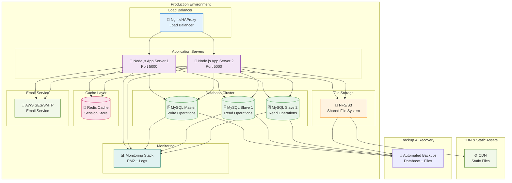

# eCerti System Architecture & UML Diagrams

## System Overview

The eCerti system is a comprehensive digital certificate management platform built with a modern web architecture. It provides secure certificate generation, QR code verification, and complete administrative control for educational institutions.

### Technology Stack

- **Frontend**: React.js with React Router
- **Backend**: Node.js with Express.js
- **Database**: MySQL with connection pooling
- **Authentication**: Session-based with OTP verification
- **Email Service**: Nodemailer with SMTP
- **File Processing**: PDF generation with Puppeteer
- **Security**: AES-256-CBC encryption for OTPs

### System Components

- **User Interface Layer**: React components for admin and student dashboards
- **API Layer**: RESTful endpoints for all business operations
- **Business Logic Layer**: Controllers handling certificate generation, user management
- **Data Access Layer**: MySQL database with optimized queries
- **Infrastructure Layer**: File storage, email service, session management

---

## Class Diagram

```mermaid
classDiagram
    %% Core Entities
    class User {
        +id: int
        +username: varchar
        +email: varchar
        +password: varchar (hashed)
        +role: enum (0=student, 1=admin)
        +full_name: varchar
        +roll_number: varchar
        +course: varchar
        +branch: varchar
        +created_at: timestamp
        +updated_at: timestamp
        +registerUser()
        +loginUser()
        +changePassword()
        +getProfile()
    }

    class Certificate {
        +id: int
        +reference_num: varchar (unique)
        +serial_num: varchar
        +full_name: varchar
        +roll_number: varchar
        +parent_name: varchar
        +gender: enum
        +certificate_type: varchar
        +course: varchar
        +branch: varchar
        +present_year: varchar
        +academic_year: varchar
        +issued_date: datetime
        +status: varchar
        +user_id: int
        +template_id: int
        +qr_code_path: varchar
        +verification_token: varchar
        +requestCertificate()
        +approveCertificate()
        +generatePDF()
        +generateQR()
        +verifyCertificate()
    }

    class CertificateTemplate {
        +id: int
        +name: varchar
        +type: varchar
        +description: text
        +html_content: longtext
        +css_styles: longtext
        +background_image: varchar
        +logo_path: varchar
        +hod_signature: varchar
        +principal_signature: varchar
        +is_active: boolean
        +created_by: int
        +created_at: timestamp
        +uploadTemplate()
        +renderTemplate()
        +updateTemplate()
        +deleteTemplate()
    }

    class QRVerificationLog {
        +id: int
        +certificate_id: int
        +reference_num: varchar
        +timestamp: datetime
        +ip_address: varchar
        +user_agent: text
        +is_valid: boolean
        +error_message: text
        +logVerification()
        +getVerificationHistory()
    }

    class OTPRecord {
        +id: int
        +email: varchar
        +otp_code: varchar (encrypted)
        +purpose: varchar
        +expires_at: datetime
        +is_used: boolean
        +created_at: timestamp
        +generateOTP()
        +verifyOTP()
        +expireOTP()
    }

    %% Controllers
    class AuthController {
        +registerUser(req, res)
        +loginUser(req, res)
        +logoutUser(req, res)
        +sendOTP(req, res)
        +verifyOTP(req, res)
        +resetPassword(req, res)
        +validateSession(req, res)
    }

    class CertificateController {
        +requestCertificate(req, res)
        +approveCertificate(req, res)
        +generateCertificate(req, res)
        +getCertificates(req, res)
        +downloadCertificate(req, res)
        +verifyCertificate(req, res)
        +getQRLogs(req, res)
    }

    class TemplateController {
        +uploadTemplate(req, res)
        +getTemplates(req, res)
        +updateTemplate(req, res)
        +deleteTemplate(req, res)
        +renderTemplate(req, res)
    }

    class UserController {
        +getUsers(req, res)
        +updateUser(req, res)
        +getUserProfile(req, res)
        +changePassword(req, res)
    }

    %% Services
    class EmailService {
        +sendOTP(email, otp)
        +sendCertificate(email, certificatePath)
        +sendNotification(email, subject, message)
    }

    class PDFService {
        +generatePDF(template, data)
        +addQRCode(pdf, qrPath)
        +savePDF(pdf, path)
    }

    class QRService {
        +generateQR(data, options)
        +saveQR(qr, path)
        +verifyQR(token)
    }

    class EncryptionService {
        +encryptOTP(otp)
        +decryptOTP(encryptedOTP)
        +hashPassword(password)
        +verifyPassword(password, hash)
    }

    %% Database Layer
    class DatabaseConnection {
        +connect()
        +disconnect()
        +query(sql, params)
        +transaction(callback)
    }

    %% Relationships
    User ||--o{ Certificate : requests
    User ||--o{ CertificateTemplate : creates
    Certificate ||--|| QRVerificationLog : generates
    Certificate ||--|| CertificateTemplate : uses
    CertificateController --> Certificate : manages
    CertificateController --> PDFService : uses
    CertificateController --> QRService : uses
    AuthController --> User : manages
    AuthController --> OTPRecord : manages
    AuthController --> EncryptionService : uses
    AuthController --> EmailService : uses
    TemplateController --> CertificateTemplate : manages
    UserController --> User : manages
    DatabaseConnection --> User : persists
    DatabaseConnection --> Certificate : persists
    DatabaseConnection --> CertificateTemplate : persists
    DatabaseConnection --> QRVerificationLog : persists
    DatabaseConnection --> OTPRecord : persists
```

---

## Use Case Diagram

```mermaid
graph TD
    %% Actors
    A[Student]:::student
    B[Administrator]:::admin
    C[Public User]:::public

    %% Student Use Cases
    A --> UC1[Register Account]
    A --> UC2[Login to System]
    A --> UC3[Request Certificate]
    A --> UC4[View Certificate Status]
    A --> UC5[Download Certificate]
    A --> UC6[Change Password]
    A --> UC7[View Profile]

    %% Administrator Use Cases
    B --> UC8[Login to Admin Panel]
    B --> UC9[Review Certificate Requests]
    B --> UC10[Approve/Reject Certificates]
    B --> UC11[Generate Certificates]
    B --> UC12[Manage Templates]
    B --> UC13[Manage Users]
    B --> UC14[View QR Verification Logs]
    B --> UC15[Change Password]

    %% Public User Use Cases
    C --> UC16[Scan QR Code]
    C --> UC17[Verify Certificate]

    %% System Use Cases
    UC1 --> SYS1[Send OTP Email]
    UC2 --> SYS2[Validate Credentials]
    UC3 --> SYS3[Store Certificate Request]
    UC4 --> SYS4[Check Request Status]
    UC5 --> SYS5[Generate PDF]
    UC6 --> SYS6[Update Password Hash]
    UC7 --> SYS7[Retrieve User Data]
    UC8 --> SYS8[Validate Admin Role]
    UC9 --> SYS9[Query Pending Requests]
    UC10 --> SYS10[Update Certificate Status]
    UC11 --> SYS11[Create PDF with QR]
    UC12 --> SYS12[Upload Template Files]
    UC13 --> SYS13[CRUD User Operations]
    UC14 --> SYS14[Query Verification Logs]
    UC15 --> SYS6
    UC16 --> SYS15[Decode QR URL]
    UC17 --> SYS16[Validate Certificate Data]

    %% System Boundaries
    SYS1 --> EMAIL[Email Service]
    SYS5 --> PDF[PDF Generator]
    SYS11 --> PDF
    SYS12 --> FILE[File Storage]
    SYS16 --> DB[(Database)]

    %% Styling
    classDef student fill:#e1f5fe,stroke:#01579b,stroke-width:2px
    classDef admin fill:#f3e5f5,stroke:#4a148c,stroke-width:2px
    classDef public fill:#e8f5e8,stroke:#1b5e20,stroke-width:2px
    classDef system fill:#fff3e0,stroke:#e65100,stroke-width:2px
```



---

## Sequence Diagram



---

## Activity Diagram

```mermaid
stateDiagram-v2
    [*] --> LoginChoice

    state LoginChoice as "User Choice"
    LoginChoice --> StudentLogin : Student Login
    LoginChoice --> AdminLogin : Admin Login
    LoginChoice --> PublicVerification : Public QR Scan

    %% Student Flow
    state StudentLogin as "Student Authentication"
    StudentLogin --> StudentDashboard : Login Success
    StudentLogin --> LoginChoice : Login Failed

    state StudentDashboard as "Student Dashboard"
    StudentDashboard --> CertificateRequest : Apply Certificate
    StudentDashboard --> ViewStatus : View Status
    StudentDashboard --> DownloadCertificate : Download Certificate
    StudentDashboard --> ChangePassword : Change Password
    StudentDashboard --> Logout : Logout

    state CertificateRequest as "Certificate Application"
    CertificateRequest --> StudentDashboard : Request Submitted

    state ViewStatus as "View Certificate Status"
    ViewStatus --> StudentDashboard : Status Viewed

    state DownloadCertificate as "Download Certificate"
    DownloadCertificate --> StudentDashboard : Download Complete

    state ChangePassword as "Password Change"
    ChangePassword --> StudentDashboard : Password Updated

    %% Admin Flow
    state AdminLogin as "Admin Authentication"
    AdminLogin --> AdminDashboard : Login Success
    AdminLogin --> LoginChoice : Login Failed

    state AdminDashboard as "Admin Dashboard"
    AdminDashboard --> ReviewRequests : Review Requests
    AdminDashboard --> ManageTemplates : Manage Templates
    AdminDashboard --> ManageUsers : Manage Users
    AdminDashboard --> ViewLogs : View QR Logs
    AdminDashboard --> AdminChangePassword : Change Password
    AdminDashboard --> AdminLogout : Logout

    state ReviewRequests as "Certificate Requests Review"
    ReviewRequests --> SelectTemplate : Review Details
    SelectTemplate --> GenerateCertificate : Template Selected
    GenerateCertificate --> AdminDashboard : Certificate Generated

    state ManageTemplates as "Template Management"
    ManageTemplates --> UploadTemplate : Upload New
    UploadTemplate --> AdminDashboard : Template Added
    ManageTemplates --> EditTemplate : Edit Existing
    EditTemplate --> AdminDashboard : Template Updated
    ManageTemplates --> DeleteTemplate : Delete Template
    DeleteTemplate --> AdminDashboard : Template Deleted

    state ManageUsers as "User Management"
    ManageUsers --> ViewUsers : View All Users
    ViewUsers --> AdminDashboard : Users Listed
    ManageUsers --> EditUser : Edit User
    EditUser --> AdminDashboard : User Updated

    state ViewLogs as "QR Verification Logs"
    ViewLogs --> AdminDashboard : Logs Displayed

    state AdminChangePassword as "Admin Password Change"
    AdminChangePassword --> AdminDashboard : Password Updated

    %% Public Verification Flow
    state PublicVerification as "Public QR Verification"
    PublicVerification --> VerifyCertificate : QR Scanned
    VerifyCertificate --> DisplayResult : Verification Complete
    DisplayResult --> [*] : Close Browser

    %% Logout States
    Logout --> [*]
    AdminLogout --> [*]

    %% Styling
    classDef student fill:#e1f5fe,stroke:#01579b
    classDef admin fill:#f3e5f5,stroke:#4a148c
    classDef public fill:#e8f5e8,stroke:#1b5e20
    classDef system fill:#fff3e0,stroke:#e65100

    class StudentLogin,StudentDashboard,CertificateRequest,ViewStatus,DownloadCertificate,ChangePassword student
    class AdminLogin,AdminDashboard,ReviewRequests,SelectTemplate,GenerateCertificate,ManageTemplates,UploadTemplate,EditTemplate,DeleteTemplate,ManageUsers,ViewUsers,EditUser,ViewLogs,AdminChangePassword admin
    class PublicVerification,VerifyCertificate,DisplayResult public
```

---

## System Architecture Diagram

```mermaid
graph TB
    %% User Layer
    subgraph "User Layer"
        STU[👨‍🎓 Student<br/>Browser]
        ADM[👨‍💼 Administrator<br/>Browser]
        PUB[🌐 Public User<br/>Browser/Mobile]
    end

    %% Presentation Layer
    subgraph "Presentation Layer"
        subgraph "Frontend Application"
            REACT[⚛️ React.js<br/>SPA]
            ROUTER[🔀 React Router<br/>Navigation]
            COMPONENTS[🧩 UI Components<br/>Forms, Tables, Modals]
            HOOKS[🪝 Custom Hooks<br/>Session, API Calls]
        end
    end

    %% Application Layer
    subgraph "Application Layer"
        subgraph "Backend API"
            EXPRESS[🚀 Express.js<br/>Web Server]
            MIDDLEWARE[🔧 Middleware<br/>Auth, CORS, Validation]

            subgraph "Controllers"
                AUTH_CTRL[🔐 Auth Controller<br/>Login, Register, OTP]
                CERT_CTRL[📜 Certificate Controller<br/>Generate, Approve, Verify]
                TEMP_CTRL[📄 Template Controller<br/>CRUD Operations]
                USER_CTRL[👥 User Controller<br/>Profile Management]
            end

            subgraph "Routes"
                AUTH_ROUTES[/api/auth/*]
                CERT_ROUTES[/api/certificates/*]
                TEMP_ROUTES[/api/templates/*]
                USER_ROUTES[/api/users/*]
            end
        end
    end

    %% Business Logic Layer
    subgraph "Business Logic Layer"
        subgraph "Services"
            EMAIL_SVC[📧 Email Service<br/>Nodemailer]
            PDF_SVC[📄 PDF Service<br/>Puppeteer]
            QR_SVC[📱 QR Service<br/>qrcode]
            ENCRYPT_SVC[🔒 Encryption Service<br/>AES-256-CBC]
            SESSION_SVC[💾 Session Service<br/>express-session]
        end
    end

    %% Data Access Layer
    subgraph "Data Access Layer"
        subgraph "Database Layer"
            MYSQL[(🗄️ MySQL Database<br/>Connection Pool)]
            DB_CONFIG[⚙️ Database Config<br/>Connection Settings]
        end

        subgraph "File Storage"
            CERT_FILES[📁 Certificate PDFs<br/>/public/certificates/]
            QR_FILES[📁 QR Code Images<br/>/public/qr-codes/]
            TEMP_FILES[📁 Templates<br/>/public/templates/]
            ASSET_FILES[📁 Assets<br/>/public/assets/]
        end
    end

    %% Infrastructure Layer
    subgraph "Infrastructure Layer"
        subgraph "External Services"
            SMTP[📮 SMTP Server<br/>Gmail/Outlook]
            FILE_SYSTEM[💿 Local File System<br/>Disk Storage]
        end
    end

    %% Data Flow
    STU --> REACT
    ADM --> REACT
    PUB --> REACT

    REACT --> ROUTER
    ROUTER --> COMPONENTS
    COMPONENTS --> HOOKS

    HOOKS --> EXPRESS
    EXPRESS --> MIDDLEWARE
    MIDDLEWARE --> AUTH_ROUTES
    MIDDLEWARE --> CERT_ROUTES
    MIDDLEWARE --> TEMP_ROUTES
    MIDDLEWARE --> USER_ROUTES

    AUTH_ROUTES --> AUTH_CTRL
    CERT_ROUTES --> CERT_CTRL
    TEMP_ROUTES --> TEMP_CTRL
    USER_ROUTES --> USER_CTRL

    AUTH_CTRL --> EMAIL_SVC
    AUTH_CTRL --> ENCRYPT_SVC
    AUTH_CTRL --> SESSION_SVC

    CERT_CTRL --> PDF_SVC
    CERT_CTRL --> QR_SVC
    CERT_CTRL --> EMAIL_SVC

    TEMP_CTRL --> FILE_SYSTEM

    AUTH_CTRL --> MYSQL
    CERT_CTRL --> MYSQL
    TEMP_CTRL --> MYSQL
    USER_CTRL --> MYSQL

    PDF_SVC --> CERT_FILES
    QR_SVC --> QR_FILES
    TEMP_CTRL --> TEMP_FILES

    EMAIL_SVC --> SMTP
    PDF_SVC --> FILE_SYSTEM
    QR_SVC --> FILE_SYSTEM

    %% Styling
    classDef frontend fill:#e3f2fd,stroke:#1976d2,stroke-width:2px
    classDef backend fill:#f3e5f5,stroke:#7b1fa2,stroke-width:2px
    classDef services fill:#e8f5e8,stroke:#388e3c,stroke-width:2px
    classDef data fill:#fff3e0,stroke:#f57c00,stroke-width:2px
    classDef infra fill:#ffebee,stroke:#d32f2f,stroke-width:2px

    class REACT,ROUTER,COMPONENTS,HOOKS frontend
    class EXPRESS,MIDDLEWARE,AUTH_CTRL,CERT_CTRL,TEMP_CTRL,USER_CTRL,AUTH_ROUTES,CERT_ROUTES,TEMP_ROUTES,USER_ROUTES backend
    class EMAIL_SVC,PDF_SVC,QR_SVC,ENCRYPT_SVC,SESSION_SVC services
    class MYSQL,DB_CONFIG,CERT_FILES,QR_FILES,TEMP_FILES,ASSET_FILES data
    class SMTP,FILE_SYSTEM infra
```

---

## Database Schema Diagram



---

## Component Interaction Flow



---

## Security Architecture



---

## Deployment Architecture



---

## Performance Characteristics

### Response Times (Expected)

- **Authentication**: 200-500ms
- **Certificate Generation**: 2-5 seconds
- **QR Verification**: 100-300ms
- **Template Upload**: 500ms-2s
- **Database Queries**: 50-200ms

### Scalability Metrics

- **Concurrent Users**: 1000+ (with load balancer)
- **Certificates/Day**: 10,000+ (with PDF optimization)
- **Storage Growth**: 100MB/month (certificates + QR codes)
- **Database Size**: 1GB/year (with archiving)

### Monitoring Points

- **Application**: Response times, error rates, throughput
- **Database**: Query performance, connection pool usage
- **File System**: Storage usage, file access patterns
- **External Services**: Email delivery rates, SMTP response times

---

## Summary

This comprehensive system architecture provides a robust, scalable, and secure foundation for the eCerti digital certificate management system. The modular design ensures maintainability, while the security-first approach protects sensitive educational data. The UML diagrams illustrate the complete system interactions, data flows, and component relationships essential for development, deployment, and maintenance.
